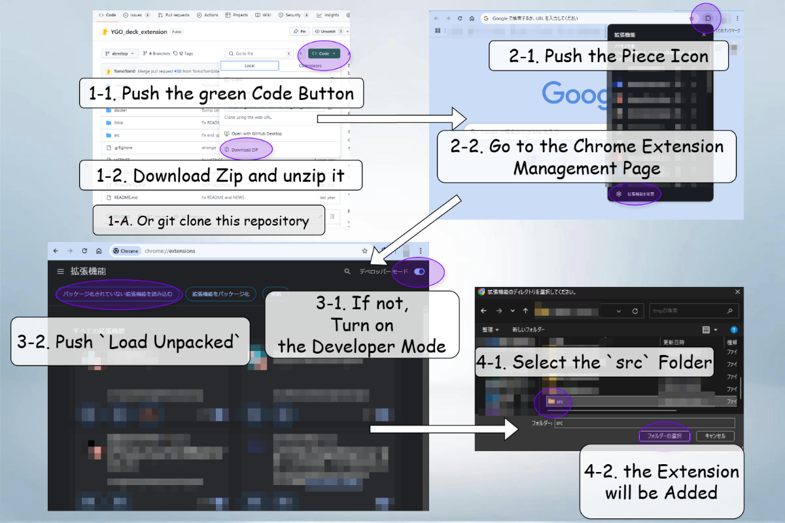

# Jira Customizer

## Overview

This chrome extension customize the Jira page layout.

**In the current version, only the backlog page is supported.**

## How to Install

1. Download or Clone this repository, and unzip it if necessary.
   You can download the zip file by clicking the `Code` button on the top of this page and selecting `Download Zip`.
2. Go to `chrome://extensions/`, and enable `Developer mode`.
3. Push `Load unpacked` ("パッケージ化されていない拡張機能を読み込む") button, and select the `src` folder in the unzipped folder.

## How to Use

### Customize the Backlog Page Layout

1. Go to the backlog page of `https://jira.*.com/` and login.
2. Push the extension icon then the popup will appear.
3. Input the column count, and push the `Apply` button.
4. Then the page layout will be changed. If push the `Toggle` button, the layout will be toggled.

## Future Work

- [ ] customize the layout of the active sprint page
- [ ] customize the layout of other pages
